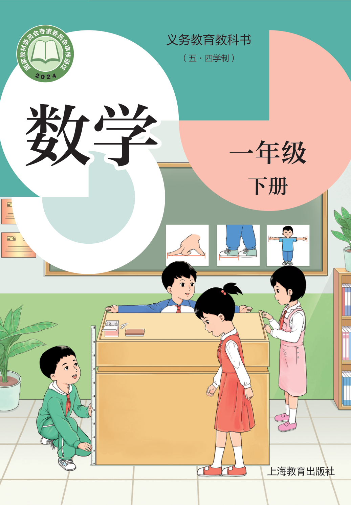
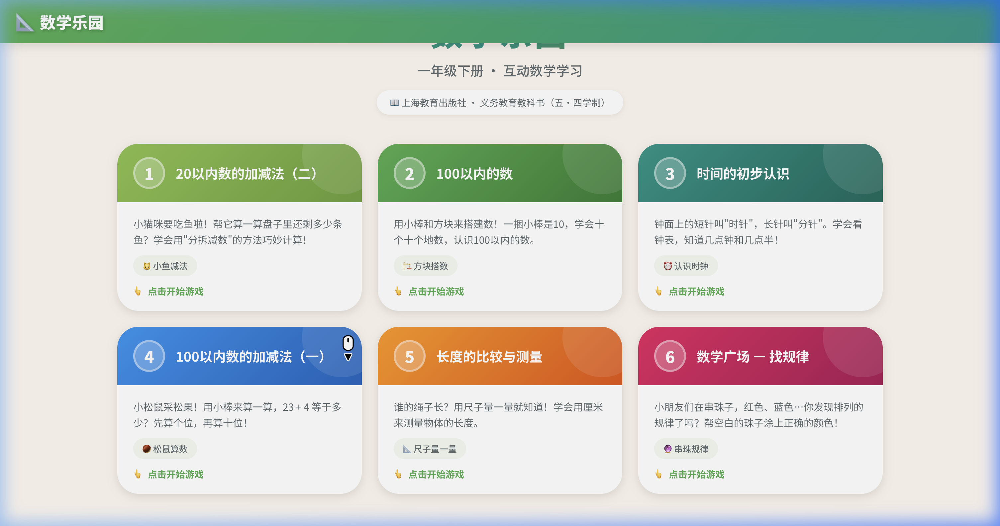
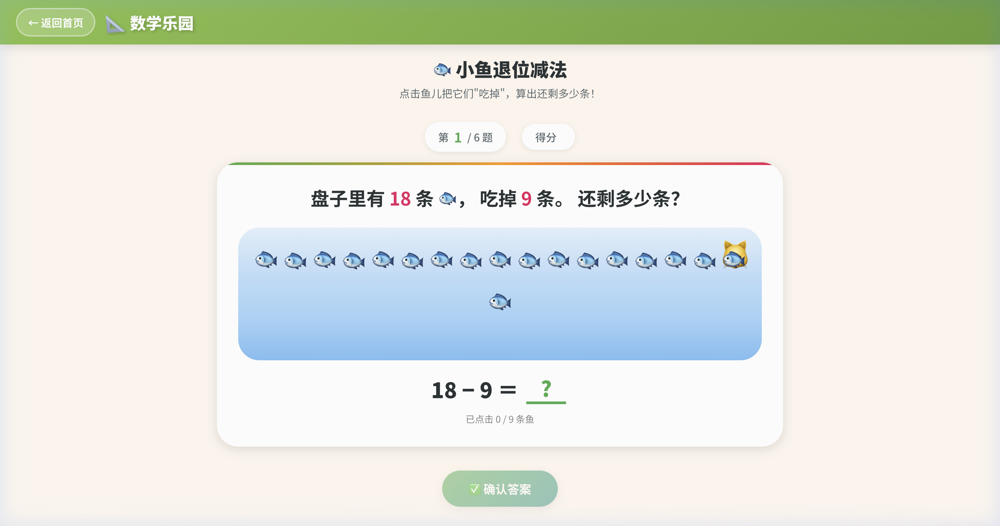
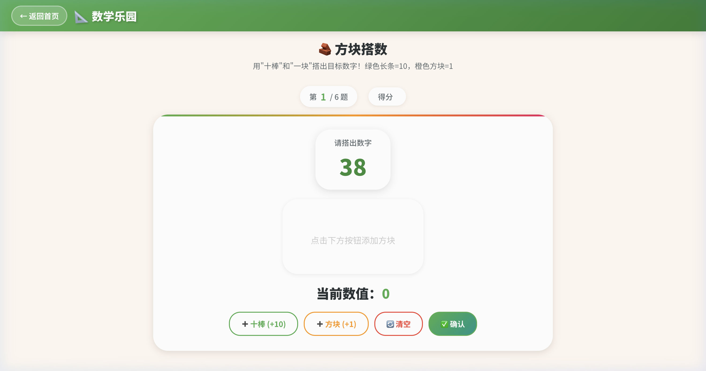
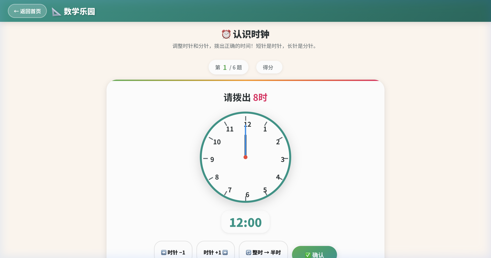
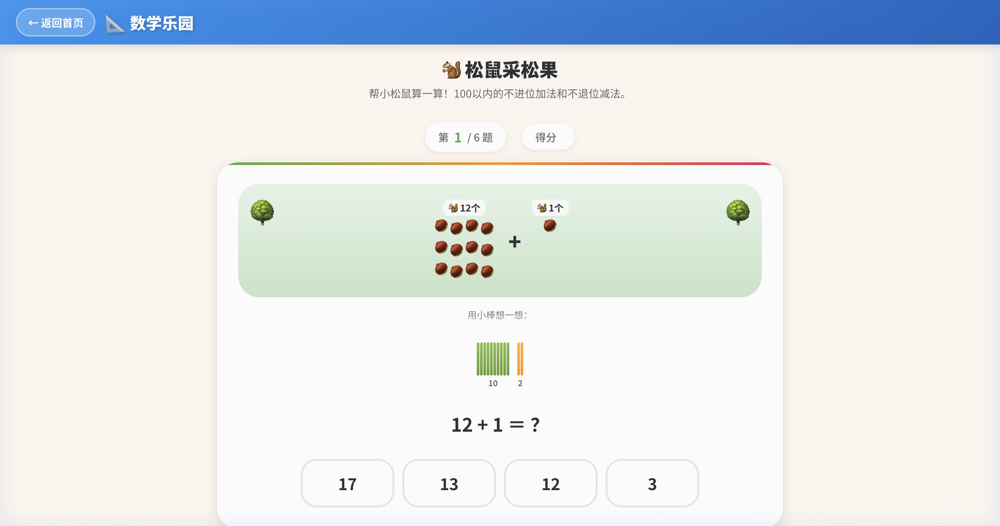
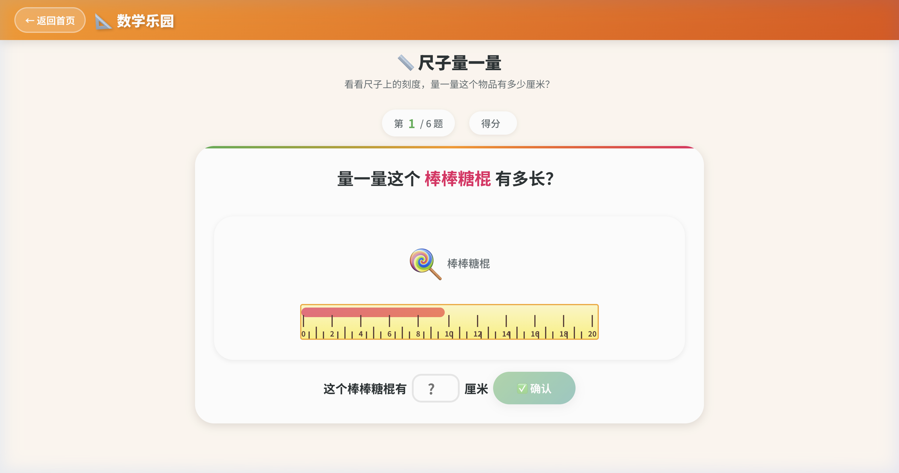
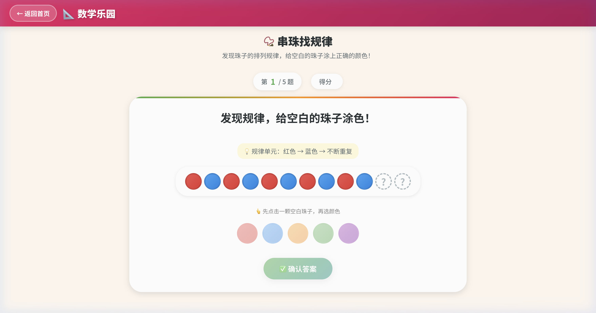

<p align="center">
  
</p>

<h1 align="center">🎓 数学乐园</h1>

<p align="center">
  <strong>一年级下册 · 互动数学学习应用</strong>
</p>

<p align="center">
  基于上海教育出版社《义务教育教科书（五·四学制）· 数学 · 一年级下册》<br/>
  将课本知识转化为 <strong>6 个趣味互动小游戏</strong>，让孩子在玩中学数学 🎮
</p>

<p align="center">
  
  
  
</p>

---

## 📸 应用截图

<p align="center">
  
</p>

---

## 🎮 六大互动游戏

### 1. 🐟 小鱼退位减法
> **对应章节：** 第 1 章 — 20 以内数的加减法（二）

点击鱼儿把它们"吃掉"来直观理解退位减法！盘子里有 12 条鱼，吃掉 9 条，还剩多少条？每道题答完后展示课本中的 **"分拆减数"** 解题步骤，帮助孩子理解 `先算 12 - 2 = 10，再算 10 - 7 = 3` 的思路。

<p align="center">
  
</p>

---

### 2. 🧱 方块搭数
> **对应章节：** 第 2 章 — 100 以内的数

用绿色「十棒」（+10）和橙色「方块」（+1）搭出目标数字！直观学习 **十进制** 和 **位值** 概念。例如：38 = 3 个十 + 8 个一。

<p align="center">
  
</p>

---

### 3. ⏰ 认识时钟
> **对应章节：** 第 3 章 — 时间的初步认识

通过按钮调节时针大小，切换整时/半时模式，拨出正确的时间。学习 **"钟面上的短针叫时针，长针叫分针"**，掌握整时和半时的认识。

<p align="center">
  
</p>

---

### 4. 🐿️ 松鼠采松果
> **对应章节：** 第 4 章 — 100 以内数的加减法（一）

帮小松鼠算松果！配有 **小棒可视化**（一捆绿棒 = 10，散棒 = 个位），四选一答题。学习不进位加法和不退位减法：先算个位，再看十位。

<p align="center">
  
</p>

---

### 5. 📏 尺子量一量
> **对应章节：** 第 5 章 — 长度的比较与测量

用虚拟尺子测量铅笔、蜡笔、钥匙等物品的长度，小朋友需要读取尺子上的刻度并输入正确的 **厘米数**。

<p align="center">
  
</p>

---

### 6. 📿 串珠找规律
> **对应章节：** 第 7 章 — 数学广场·找规律

发现珠子颜色的排列规律（如 🔴→🔵→🔴→🔵…），然后给空白珠子涂上正确的颜色。训练 **模式识别** 和 **逻辑推理** 能力。

<p align="center">
  
</p>

---

## ✨ 应用特色

| 特性 | 说明 |
|:---:|------|
| 🎨 **课本配色** | 每个章节使用与原课本一致的绿/蓝/橙/粉色系渐变 |
| 📖 **教学解释** | 每道题答完后展示课本原理与解题步骤 |
| ⭐ **星级评价** | 完成游戏后根据正确率获得 1~3 星评价 |
| 🎉 **庆祝动画** | 答对时彩色纸屑撒花效果，增强正反馈 |
| 🔁 **随机出题** | 每次游戏题目随机生成，可反复练习 |
| 📱 **响应式** | 适配桌面和平板设备 |

---

## 🚀 快速开始

### 环境要求

- [Node.js](https://nodejs.org/) 18+
- npm 或 yarn

### 安装与运行

```bash
# 克隆项目
git clone https://github.com/your-username/math-adventure.git
cd math-adventure

# 安装依赖
npm install

# 启动开发服务器
npm run dev
```

打开浏览器访问 `http://localhost:5173` 即可体验 🎉

### 构建生产版本

```bash
npm run build
```

构建产物在 `dist/` 目录下，可直接部署到任意静态托管服务。

---

## 📁 项目结构

```
math-adventure/
├── index.html                          # 入口 HTML
├── package.json
├── vite.config.js
├── public/
│   └── images/                         # 课本原图 & 截图
├── src/
│   ├── main.jsx                        # React 入口
│   ├── App.jsx                         # 路由配置
│   ├── index.css                       # 全局设计系统（配色、动画、布局）
│   ├── pages/
│   │   ├── Home.jsx                    # 🏠 首页（章节卡片网格）
│   │   └── GamePage.jsx                # 🎮 游戏页面路由包装器
│   └── components/
│       ├── Confetti.jsx                # 🎉 庆祝撒花动画
│       └── games/
│           ├── FishPondGame.jsx        # 🐟 第1章：小鱼退位减法
│           ├── BlockBuilderGame.jsx    # 🧱 第2章：方块搭数
│           ├── ClockGame.jsx           # ⏰ 第3章：认识时钟
│           ├── AcornGame.jsx           # 🐿️ 第4章：松鼠采松果
│           ├── RulerGame.jsx           # 📏 第5章：尺子量一量
│           └── PatternGame.jsx         # 📿 第7章：串珠找规律
```

---

## 🛠 技术栈

- **框架**: [React](https://react.dev/) 19
- **构建工具**: [Vite](https://vitejs.dev/) 8
- **路由**: [React Router](https://reactrouter.com/) v7
- **样式**: Vanilla CSS（自定义设计系统）
- **字体**: [Noto Sans SC](https://fonts.google.com/noto/specimen/Noto+Sans+SC)（思源黑体）

---

## 📚 课本信息

| 项目 | 内容 |
|------|------|
| **书名** | 义务教育教科书（五·四学制）数学 一年级下册 |
| **出版社** | 上海教育出版社 |
| **主编** | 李大潜 |
| **版次** | 2024年12月第1版 |
| **ISBN** | 978-7-5720-3241-7 |

---

## 📄 许可证

本项目仅供学习和教育用途。课本内容版权归上海教育出版社所有。

---

<p align="center">
  用 ❤️ 和 React 为小朋友们制作
</p>
